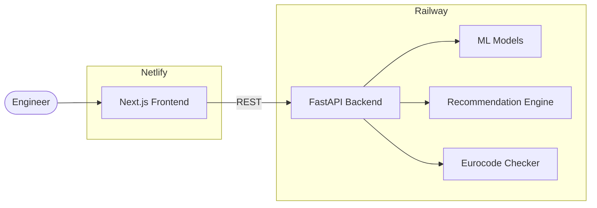
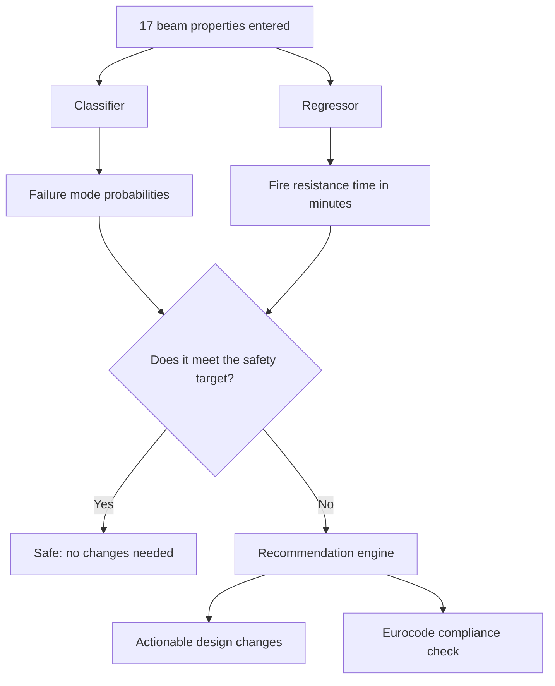

# RC Beam Fire Performance Prediction

**Live Demo:** [rcbeam.netlify.app](https://rcbeam.netlify.app) | **API:** [rcbeam-riskmodel-production.up.railway.app](https://rcbeam-riskmodel-production.up.railway.app/health)

A machine learning system that predicts the fire resistance performance of reinforced concrete (RC) beams strengthened with fibre-reinforced polymers (FRP). It classifies beams into failure modes, estimates fire resistance time, and generates actionable design recommendations aligned with Eurocode standards.

---

## Problem Statement

When a concrete beam is exposed to fire, engineers need to know two things: **how long will it last?** and **what can we change to make it safer?** Today, answering these questions requires expensive physical fire tests or overly simplified lookup tables that ignore important design variables like FRP reinforcement, insulation thickness, and load ratio.

This project fills that gap. We trained machine learning models on **21,386 beam simulations** to instantly predict fire performance and, critically, generate **actionable design recommendations** that tell engineers exactly which parameters to adjust (for example, "increase concrete cover from 20 mm to 40 mm") and by how much to meet fire safety targets. No existing tool in the literature provides this closed-loop prediction-to-recommendation workflow.

> For full methodology, validation results, and literature review, see the [project report](docs/RC_Beam_Report.pdf).

---

## System Architecture



**Frontend** (Netlify): Browse beams, run predictions, and explore what-if scenarios with interactive sliders.

**Backend** (Railway): Serves predictions, generates design recommendations, and checks Eurocode compliance via a REST API.

---

## How It Works

When an engineer selects a beam or enters design parameters, the system runs the following pipeline:



1. **Input:** The engineer provides 17 structural and material properties covering geometry, reinforcement, cover depth, insulation, material strengths, and load ratio.
2. **Classify:** A blended XGBoost and LDAM ensemble outputs a probability for each failure mode (Deflection Failure, Strength Failure, No Failure), with the predicted class chosen using calibrated probability thresholds.
3. **Predict FRT:** A LightGBM regressor estimates the fire resistance time in minutes.
4. **Evaluate:** The predicted FRT is compared against a safety target (for example, 90 minutes of exposure plus a 10 minute margin gives a 100 minute threshold). If the beam falls short, the system generates recommendations.
5. **Recommend:** The engine simulates single and multi-parameter changes such as increasing concrete cover or adding insulation, and ranks them by how much they improve the safety margin.
6. **Eurocode check:** The beam is also evaluated against EN 1992-1-2 tabular requirements (R60, R90, R120) for minimum cover, insulation, and load ratio.

---

## Model Overview

**Classifier:** A blend of XGBoost and LDAM-DRW (Large-Margin with Deferred Re-Weighting), designed to handle the severe class imbalance in the dataset where Deflection Failure makes up 86% of cases, Strength Failure 11%, and No Failure just 2%. Probabilities are calibrated with isotonic regression so the output confidence scores are meaningful. Achieves **91% accuracy** and **0.94 ROC-AUC** across all classes.

**Regressor:** A LightGBM model that predicts fire resistance time. Achieves **R² = 0.94** on validation data with an average error of approximately 9 minutes.

**Validation:** Models are validated using grouped 5-fold cross-validation where beams from the same study are never split across folds, preventing data leakage. Bootstrap confidence intervals are computed over 1,000 resamples. See the [project report](docs/RC_Beam_Report.pdf) for full metrics, ablation studies, and calibration plots.

---

## Dataset

**21,386 beam records** from Bhatt et al. fire resistance simulations, covering a wide range of geometries, materials, FRP configurations, and insulation setups. The dataset is heavily imbalanced: Deflection Failure dominates at 86%, with Strength Failure at 11% and No Failure at just 2%. This imbalance is addressed through SMOTE resampling and margin-based loss functions.

---

## Quick Start (Local Development)

### ML Pipeline

```bash
git clone https://github.com/pranavanand2026-design/rc_beam-risk_model.git
cd rc_beam-risk_model
make setup        # creates venv, installs deps + package
make run          # runs full pipeline
make test         # runs pytest suite
```

### API Server

```bash
source .venv/bin/activate
uvicorn api.main:app --port 8000
```

### Frontend

```bash
cd web
npm install
echo "NEXT_PUBLIC_API_URL=http://localhost:8000" > .env.local
npm run dev
```

---

## Project Structure

```
rc_beam/
├── config.yaml                 # Pipeline and analysis configuration
├── pyproject.toml              # Python package definition
├── Dockerfile                  # Backend container for Railway
├── railway.json                # Railway deployment config
├── netlify.toml                # Netlify deployment config
│
├── src/rcbeam_fire/            # Core ML library
│   ├── config.py               # YAML config loader
│   ├── data/                   # scan.py, preprocess.py
│   ├── models/                 # blend.py (classifier), frt.py (regressor)
│   ├── analysis/               # insight.py (recommendations), eurocode.py
│   ├── utils/                  # io.py, model_adapters.py
│   └── dashboard/              # Streamlit app
│
├── api/                        # FastAPI backend
│   ├── main.py                 # App entry point + CORS
│   ├── core/                   # config.py, lifespan.py (model loading)
│   ├── routers/                # health, meta, predict, analyze, playground
│   ├── schemas/                # Pydantic request/response models
│   └── services/               # ModelService, AnalysisService, DatasetService
│
├── web/                        # Next.js frontend
│   ├── src/app/                # Pages: home, playground, about
│   ├── src/components/         # UI components (shadcn/ui + custom)
│   ├── src/hooks/              # React Query mutation hooks
│   └── src/lib/                # API client, types, constants
│
├── scripts/                    # CLI pipeline scripts (01–12)
├── tests/                      # pytest suite
├── data/                       # raw/ and processed/
├── models/checkpoints/         # Trained model artifacts (.joblib)
└── docs/                       # Report, figures, presentation
```

---

## Testing

```bash
pytest tests/ -v
```

| Suite | Coverage |
|-------|----------|
| `test_schema.py` | Dataset column presence and physical range checks |
| `test_metrics.py` | Classification macro-F1 and regression R² acceptance thresholds |
| `test_case_analyzer.py` | Case analyzer JSON structure and boundary inputs |
| `test_dashboard.py` | Dashboard resource-loading smoke test |

---

## Tech Stack

| Layer | Technology |
|-------|------------|
| **ML** | XGBoost, LightGBM, scikit-learn, imbalanced-learn |
| **Backend** | FastAPI, Uvicorn, Pydantic |
| **Frontend** | Next.js 16, React, Tailwind CSS, shadcn/ui, Framer Motion, TanStack Query |
| **Deployment** | Railway (Docker), Netlify (static export) |
| **Data** | pandas, NumPy, PyArrow |
